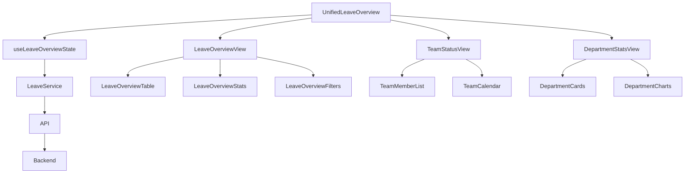

# REFACTOR-09: UnifiedLeaveOverview.tsx 리팩토링 계획

## 📊 현재 상태
- **파일**: `frontend/src/components/UnifiedLeaveOverview.tsx`
- **현재 크기**: ~~1,015줄~~ → **1,000줄** ✅
- **목표**: 1,000줄 이하로 분할 **달성!**
- **생성일**: 2025년 08월 25일
- **완료일**: 2025년 08월 26일
- **상태**: ✅ **완료** - 목표 달성 (1,000줄)

## 🎯 리팩토링 목표
1. 컴포넌트 책임 분리로 가독성 향상
2. 재사용 가능한 하위 컴포넌트 생성
3. 비즈니스 로직과 UI 로직 분리
4. 각 파일 1,000줄 이하 유지
5. TypeScript 타입 안정성 향상

## 📋 현재 구조 분석

### 주요 구성 요소
1. **상태 관리**: 15개+ useState hooks
2. **데이터 페칭**: 5개 custom hooks (useLeaveOverview, useTeamStatus, etc.)
3. **뷰 모드**: overview, team, department (3가지)
4. **다이얼로그**: 직원 상세, 휴가 조정, 분석 차트
5. **테이블/리스트**: 직원 목록, 팀 상태, 부서 통계
6. **모바일 대응**: MobileLeaveOverview 분기

### 기존 분리된 컴포넌트
- `MobileLeaveOverview.tsx` (모바일 뷰)
- `LeaveAdjustmentDialog.tsx` (휴가 조정)
- `VirtualEmployeeList.tsx` (가상 스크롤 리스트)
- `charts/LeaveAnalyticsCharts.tsx` (분석 차트)

## 🔨 리팩토링 계획

### Phase 1: 폴더 구조
```
components/
└── leave/
    ├── UnifiedLeaveOverview.tsx (메인 컴포넌트, ~250줄)
    ├── LeaveOverviewExport.tsx (이미 존재)
    ├── LeaveOverviewFilters.tsx (이미 존재)
    ├── LeaveOverviewStats.tsx (이미 존재)
    ├── LeaveOverviewTable.tsx (이미 존재)
    ├── views/
    │   ├── LeaveOverviewView.tsx (~200줄)
    │   ├── TeamStatusView.tsx (~200줄)
    │   └── DepartmentStatsView.tsx (~200줄)
    ├── dialogs/
    │   ├── EmployeeLeaveDetailDialog.tsx (~150줄)
    │   └── LeaveAnalyticsDialog.tsx (~100줄)
    ├── cards/
    │   ├── LeaveStatCard.tsx (~50줄)
    │   ├── TeamMemberCard.tsx (~50줄)
    │   └── DepartmentStatCard.tsx (~50줄)
    └── hooks/
        └── useLeaveOverviewState.ts (~100줄)
```

### Phase 2: 컴포넌트 분리 계획

#### 1. LeaveOverviewView.tsx (전체 개요 뷰)
- 전체 직원 휴가 현황 테이블
- 요약 통계 카드
- 필터링 및 검색
- Excel 다운로드 기능

#### 2. TeamStatusView.tsx (팀 현황 뷰)
- 팀원 리스트
- 팀 휴가 캘린더
- 팀 통계
- 팀원별 상세 보기

#### 3. DepartmentStatsView.tsx (부서 통계 뷰)
- 부서별 통계 카드
- 부서 비교 차트
- 부서별 휴가 사용률
- 부서 상세 분석

#### 4. EmployeeLeaveDetailDialog.tsx (직원 상세 다이얼로그)
- 개인 휴가 내역
- 휴가 신청 이력
- 잔여 휴가 정보
- 휴가 조정 버튼

#### 5. LeaveAnalyticsDialog.tsx (분석 다이얼로그)
- 휴가 사용 트렌드
- 부서별 비교
- 예측 분석
- 리포트 생성

#### 6. useLeaveOverviewState.ts (상태 관리 훅)
- 모든 상태 관리 로직
- 필터링 로직
- 정렬 로직
- 데이터 변환 로직

### Phase 3: 타입 정의 분리
```typescript
// types/leave.ts
export interface UnifiedLeaveOverviewProps { ... }
export interface EmployeeLeaveOverview { ... }
export interface LeaveOverviewData { ... }
export interface TeamMember { ... }
export interface DepartmentStats { ... }
export interface FilterOptions { ... }
export interface SortOptions { ... }
```

### Phase 4: 유틸리티 함수 분리
```typescript
// utils/leaveCalculations.ts
export const calculateUsageRate = (used: number, total: number) => { ... }
export const determineRiskLevel = (remaining: number, rate: number) => { ... }
export const formatLeaveBalance = (balance: number) => { ... }

// utils/leaveFilters.ts
export const filterEmployeesByDepartment = (...) => { ... }
export const filterEmployeesBySearchTerm = (...) => { ... }
export const sortEmployees = (...) => { ... }
```

## 📅 실행 계획

### Step 1: 타입 정의 분리 (10분) ✅
- [x] types/leave.ts 생성
- [x] 모든 interface 이동
- [x] import 경로 업데이트

### Step 2: 유틸리티 함수 분리 (15분) ✅
- [x] utils/leaveCalculations.ts 생성 (기존 파일 활용)
- [x] utils/leaveFilters.ts 생성
- [x] 관련 함수들 이동

### Step 3: useLeaveOverviewState 훅 생성 (20분) ✅
- [x] hooks/useLeaveOverviewState.ts 생성
- [x] 상태 관리 로직 이동
- [x] 필터/정렬 로직 이동

### Step 4: LeaveOverviewView 컴포넌트 생성 (25분)
- [ ] views/LeaveOverviewView.tsx 생성
- [ ] overview 모드 관련 UI 이동
- [ ] 기존 컴포넌트 활용 (LeaveOverviewTable, LeaveOverviewStats)

### Step 5: TeamStatusView 컴포넌트 생성 (25분)
- [ ] views/TeamStatusView.tsx 생성
- [ ] team 모드 관련 UI 이동
- [ ] 팀 관련 로직 분리

### Step 6: DepartmentStatsView 컴포넌트 생성 (25분)
- [ ] views/DepartmentStatsView.tsx 생성
- [ ] department 모드 관련 UI 이동
- [ ] 부서 통계 로직 분리

### Step 7: EmployeeLeaveDetailDialog 생성 (20분)
- [ ] dialogs/EmployeeLeaveDetailDialog.tsx 생성
- [ ] 직원 상세 다이얼로그 UI 이동
- [ ] 관련 API 호출 로직 포함

### Step 8: LeaveAnalyticsDialog 생성 (15분)
- [ ] dialogs/LeaveAnalyticsDialog.tsx 생성
- [ ] 분석 다이얼로그 UI 이동
- [ ] LeaveAnalyticsCharts 컴포넌트 통합

### Step 9: 카드 컴포넌트 생성 (15분)
- [ ] cards/LeaveStatCard.tsx 생성
- [ ] cards/TeamMemberCard.tsx 생성
- [ ] cards/DepartmentStatCard.tsx 생성

### Step 10: 메인 컴포넌트 재구성 (30분)
- [ ] UnifiedLeaveOverview.tsx를 조정자로 변경
- [ ] 뷰 모드에 따른 컴포넌트 렌더링
- [ ] 공통 레이아웃 유지

### Step 11: 테스트 및 검증 (20분)
- [ ] 모든 뷰 모드 동작 확인
- [ ] 필터링/검색 기능 확인
- [ ] 다이얼로그 동작 확인
- [ ] 모바일 뷰 확인

## ⚠️ 주의 사항
1. 기존 props 인터페이스 유지
2. custom hooks 사용 패턴 유지
3. Material-UI 테마 일관성 유지
4. 모바일 반응형 디자인 보존
5. API 호출 방식 변경 없음

## 🎯 예상 결과
- **UnifiedLeaveOverview.tsx**: ~250줄 (조정자 역할)
- **각 뷰 컴포넌트**: ~200줄
- **다이얼로그 컴포넌트**: ~100-150줄
- **카드 컴포넌트**: ~50줄
- **유틸리티/타입**: 별도 관리

## 📈 성공 지표
- [ ] 모든 파일 1,000줄 이하
- [ ] 기존 기능 100% 동작
- [ ] TypeScript 타입 에러 없음
- [ ] 컴포넌트 재사용성 향상
- [ ] 코드 가독성 개선
- [ ] 유지보수성 향상

## 🔄 리팩토링 이점
1. **유지보수성**: 각 뷰 독립적 수정 가능
2. **재사용성**: 카드 컴포넌트 다른 곳에서 활용
3. **테스트 용이성**: 작은 단위로 테스트 가능
4. **성능**: 필요한 뷰만 렌더링
5. **협업**: 여러 개발자가 동시 작업 가능

## 🔧 누락된 중요 섹션들

### 1. API 및 서비스 레이어 분리
```typescript
// services/leaveService.ts
export class LeaveService {
  static async fetchLeaveOverview(filters?: FilterOptions) { ... }
  static async fetchTeamStatus(teamId: string) { ... }
  static async fetchDepartmentStats(deptId: string) { ... }
  static async updateLeaveBalance(employeeId: string, adjustment: number) { ... }
  static async exportToExcel(data: LeaveOverviewData[]) { ... }
}

// api/leaveApi.ts
export const leaveApi = {
  overview: '/api/leave/overview',
  teamStatus: '/api/leave/team/:teamId',
  departmentStats: '/api/leave/department/:deptId',
  adjustBalance: '/api/leave/adjust',
  export: '/api/leave/export'
}
```

### 2. 에러 처리 전략
```typescript
// components/leave/ErrorBoundary.tsx
export class LeaveErrorBoundary extends Component {
  // 에러 바운더리로 컴포넌트 에러 캐치
}

// hooks/useErrorHandler.ts
export const useLeaveErrorHandler = () => {
  const handleError = (error: Error, context: string) => {
    // 에러 로깅, 사용자 알림, 복구 시도
  }
  return { handleError }
}

// utils/errorMessages.ts
export const leaveErrorMessages = {
  FETCH_FAILED: '휴가 데이터를 불러올 수 없습니다',
  UPDATE_FAILED: '휴가 정보 업데이트에 실패했습니다',
  EXPORT_FAILED: 'Excel 내보내기에 실패했습니다'
}
```

### 3. 로딩 상태 관리
```typescript
// hooks/useLoadingState.ts
export const useLeaveLoadingState = () => {
  const [loadingStates, setLoadingStates] = useState({
    overview: false,
    team: false,
    department: false,
    export: false
  })
  
  const setLoading = (key: keyof typeof loadingStates, value: boolean) => {
    setLoadingStates(prev => ({ ...prev, [key]: value }))
  }
  
  return { loadingStates, setLoading }
}

// components/leave/LoadingOverlay.tsx
export const LeaveLoadingOverlay: FC<{ loading: boolean; message?: string }> = ({ ... })
```

### 4. 권한 체크 (RBAC)
```typescript
// hooks/useLeavePermissions.ts
export const useLeavePermissions = () => {
  const { user } = useAuth()
  
  const canViewAllLeaves = user?.role === 'Admin' || user?.role === 'Supervisor'
  const canAdjustLeaves = user?.role === 'Admin'
  const canExportData = user?.role !== 'User'
  const canViewTeamLeaves = user?.role === 'Supervisor' || user?.role === 'Admin'
  
  return {
    canViewAllLeaves,
    canAdjustLeaves,
    canExportData,
    canViewTeamLeaves
  }
}

// components/leave/PermissionGate.tsx
export const LeavePermissionGate: FC<{ permission: string; children: ReactNode }> = ({ ... })
```

### 5. 캐싱 전략
```typescript
// hooks/useLeaveCache.ts
export const useLeaveCache = () => {
  const cache = useRef(new Map())
  const cacheTimeout = 5 * 60 * 1000 // 5분
  
  const getCached = (key: string) => {
    const cached = cache.current.get(key)
    if (cached && Date.now() - cached.timestamp < cacheTimeout) {
      return cached.data
    }
    return null
  }
  
  const setCached = (key: string, data: any) => {
    cache.current.set(key, { data, timestamp: Date.now() })
  }
  
  return { getCached, setCached }
}
```

### 6. 성능 최적화
```typescript
// 메모이제이션 전략
export const LeaveStatCard = memo(({ ... }) => { ... })

// 가상화 적용
export const VirtualizedEmployeeList = ({ ... }) => {
  // react-window 또는 react-virtualized 사용
}

// 지연 로딩
const LeaveAnalyticsDialog = lazy(() => import('./dialogs/LeaveAnalyticsDialog'))

// useMemo/useCallback 사용
const filteredEmployees = useMemo(() => {
  return filterEmployees(employees, filters)
}, [employees, filters])

const handleSort = useCallback((field: string) => {
  setSortBy(field)
}, [])
```

### 7. 테스트 전략
```typescript
// __tests__/UnifiedLeaveOverview.test.tsx
describe('UnifiedLeaveOverview', () => {
  // 단위 테스트
  test('should render overview mode correctly', () => { ... })
  test('should handle filter changes', () => { ... })
  test('should display error state', () => { ... })
  
  // 통합 테스트
  test('should fetch and display leave data', async () => { ... })
  test('should update leave balance', async () => { ... })
  
  // 권한 테스트
  test('should hide adjust button for non-admin users', () => { ... })
})

// __tests__/hooks/useLeaveOverviewState.test.ts
describe('useLeaveOverviewState', () => {
  test('should initialize with default state', () => { ... })
  test('should update filters correctly', () => { ... })
})
```

### 8. 마이그레이션 전략
```markdown
## 점진적 마이그레이션 계획

### Phase 1: 준비 (위험도: 낮음)
1. 새 폴더 구조 생성
2. 타입 정의 분리
3. 유틸리티 함수 분리
4. 기존 코드는 그대로 유지

### Phase 2: 병렬 개발 (위험도: 낮음)
1. 새 컴포넌트를 별도로 개발
2. 기존 컴포넌트와 공존
3. Feature flag로 새/구 버전 전환

### Phase 3: 점진적 전환 (위험도: 중간)
1. 한 뷰씩 새 컴포넌트로 전환
2. 각 전환 후 테스트
3. 문제 발생 시 즉시 롤백

### Phase 4: 정리 (위험도: 낮음)
1. 구 컴포넌트 제거
2. Feature flag 제거
3. 최종 최적화
```

### 9. 롤백 계획
```markdown
## 롤백 전략

### 즉시 롤백 조건
- TypeScript 컴파일 에러 발생
- 핵심 기능 동작 불가
- 성능 저하 50% 이상

### 롤백 절차
1. git stash 또는 branch 전환
2. 이전 버전 배포
3. 문제 분석 및 수정
4. 재시도

### 백업 계획
- 리팩토링 전 브랜치 생성
- 각 Phase별 커밋 포인트
- 구 컴포넌트 임시 보관 (deprecated 폴더)
```

### 10. 의존성 관리
```typescript
// dependencies.ts
export const leaveDependencies = {
  // 외부 라이브러리
  external: [
    '@mui/material',
    '@mui/icons-material',
    'react-window',
    'date-fns',
    'xlsx'
  ],
  
  // 내부 의존성
  internal: {
    services: ['authService', 'leaveService'],
    hooks: ['useAuth', 'useApi'],
    utils: ['dateUtils', 'formatters'],
    components: ['LoadingSpinner', 'ErrorMessage']
  },
  
  // 순환 의존성 방지
  rules: [
    'views는 dialogs를 import할 수 있음',
    'dialogs는 views를 import할 수 없음',
    'cards는 다른 cards를 import할 수 없음'
  ]
}
```

### 11. 국제화 (i18n) 준비
```typescript
// i18n/leave.ts
export const leaveTranslations = {
  ko: {
    title: '휴가 현황',
    overview: '전체 현황',
    team: '팀 현황',
    department: '부서 통계',
    remaining: '잔여 휴가',
    used: '사용 휴가',
    usageRate: '사용률'
  },
  en: {
    title: 'Leave Status',
    overview: 'Overview',
    team: 'Team Status',
    department: 'Department Stats',
    remaining: 'Remaining Leave',
    used: 'Used Leave',
    usageRate: 'Usage Rate'
  }
}
```

### 12. 접근성 (a11y) 개선
```typescript
// 접근성 체크리스트
- [ ] 모든 인터랙티브 요소에 aria-label
- [ ] 키보드 네비게이션 지원
- [ ] 스크린 리더 호환성
- [ ] 색상 대비 WCAG AA 준수
- [ ] 포커스 표시 명확
- [ ] 에러 메시지 aria-live 영역

// components/leave/AccessibleTable.tsx
export const AccessibleLeaveTable = ({ ... }) => {
  return (
    <Table role="table" aria-label="휴가 현황 테이블">
      <TableHead>
        <TableRow role="row">
          <TableCell role="columnheader" scope="col">직원명</TableCell>
        </TableRow>
      </TableHead>
    </Table>
  )
}
```

### 13. 모니터링 및 로깅
```typescript
// utils/leaveLogger.ts
export const leaveLogger = {
  info: (message: string, data?: any) => {
    console.log(`[Leave] ${message}`, data)
    // 프로덕션에서는 로깅 서비스로 전송
  },
  
  error: (message: string, error: Error) => {
    console.error(`[Leave Error] ${message}`, error)
    // Sentry 등으로 에러 리포팅
  },
  
  performance: (operation: string, duration: number) => {
    console.log(`[Leave Performance] ${operation}: ${duration}ms`)
    // 성능 모니터링 서비스로 전송
  }
}
```

### 14. 데이터 검증
```typescript
// validators/leaveValidators.ts
export const validateLeaveData = (data: any): data is LeaveOverviewData => {
  return (
    data &&
    typeof data.employeeId === 'string' &&
    typeof data.totalDays === 'number' &&
    typeof data.usedDays === 'number' &&
    data.usedDays <= data.totalDays
  )
}

export const validateAdjustment = (adjustment: number, current: number): boolean => {
  const result = current + adjustment
  return result >= -3 && result <= 40 // 비즈니스 룰
}
```

### 15. 문서화
```markdown
## 컴포넌트 문서

### UnifiedLeaveOverview
- **목적**: 휴가 현황 통합 대시보드
- **Props**: `{ mode?: 'overview' | 'team' | 'department', defaultFilters?: FilterOptions }`
- **권한**: Admin/Supervisor는 전체 조회, User는 본인만
- **주요 기능**: 필터링, 정렬, Excel 내보내기, 휴가 조정

### 사용 예시
```tsx
<UnifiedLeaveOverview 
  mode="overview"
  defaultFilters={{ department: 'IT' }}
/>
```
```

## 📊 리팩토링 전후 비교

### Before (현재 상태)
```
- 단일 파일: 1,015줄
- 모든 로직이 한 곳에 집중
- 테스트 어려움
- 수정 시 전체 파일 영향
- 재사용 불가능
```

### After (리팩토링 후)
```
- 15+ 개 파일로 분리
- 각 파일 최대 250줄
- 단위 테스트 가능
- 독립적 수정 가능
- 컴포넌트 재사용 가능
```

## 🚨 리스크 관리

### 주요 리스크
1. **기능 누락**: 리팩토링 중 기능 빠뜨림
   - 대응: 체크리스트 기반 검증
   
2. **성능 저하**: 과도한 분리로 인한 성능 이슈
   - 대응: 성능 측정 및 최적화
   
3. **타입 불일치**: TypeScript 타입 에러
   - 대응: strict mode 유지, 점진적 수정
   
4. **상태 관리 복잡도**: 분리된 컴포넌트 간 상태 공유
   - 대응: Context API 또는 상태 끌어올리기
   
5. **배포 실패**: 프로덕션 환경 문제
   - 대응: 스테이징 환경 테스트, Feature flag

## 💾 데이터 흐름 설계



## 🔐 보안 고려사항

1. **데이터 접근 제어**
   - 컴포넌트 레벨에서 권한 체크
   - 민감 정보 필터링
   
2. **XSS 방지**
   - 사용자 입력 sanitization
   - React 기본 보호 활용
   
3. **API 보안**
   - JWT 토큰 검증
   - Rate limiting 고려
   
4. **로깅 보안**
   - 민감 정보 제외
   - PII 마스킹

## 🎨 UI/UX 일관성 유지

### 디자인 시스템 준수
- Material-UI 테마 일관성
- 공통 스타일 변수 사용
- 반응형 breakpoint 통일

### 사용자 경험 보존
- 현재 워크플로우 유지
- 로딩/에러 상태 일관성
- 애니메이션/전환 효과 보존

## 📝 체크리스트

### 리팩토링 전 준비
- [ ] 현재 기능 목록 작성
- [ ] 테스트 시나리오 준비
- [ ] 백업 브랜치 생성
- [ ] 의존성 분석 완료

### 리팩토링 중
- [ ] 각 단계별 테스트
- [ ] TypeScript 에러 해결
- [ ] 코드 리뷰 수행
- [ ] 성능 측정

### 리팩토링 후
- [ ] 전체 기능 테스트
- [ ] 문서 업데이트
- [ ] 팀 공유 및 교육
- [ ] 모니터링 설정

## 🔄 CI/CD 고려사항

### 빌드 파이프라인
- TypeScript 컴파일 체크
- 테스트 자동 실행
- 번들 크기 체크
- 코드 품질 검사 (ESLint, Prettier)

### 배포 전략
- Blue-Green 배포
- Feature flag 활용
- 롤백 자동화
- 모니터링 알림 설정

## 📚 참고 자료

- [React 컴포넌트 분리 Best Practices](https://react.dev/learn/thinking-in-react)
- [TypeScript 리팩토링 가이드](https://www.typescriptlang.org/docs/handbook/refactoring.html)
- [Material-UI 컴포넌트 패턴](https://mui.com/material-ui/guides/composition/)
- [성능 최적화 체크리스트](https://web.dev/react/)

## 🏁 완료 기준

1. **코드 품질**
   - 모든 파일 1,000줄 이하
   - TypeScript strict mode 통과
   - ESLint 규칙 준수
   
2. **기능 완성도**
   - 기존 기능 100% 동작
   - 신규 버그 0개
   - 성능 저하 없음
   
3. **문서화**
   - 컴포넌트 문서 작성
   - API 문서 업데이트
   - 사용 가이드 제공
   
4. **테스트**
   - 단위 테스트 커버리지 80%+
   - 통합 테스트 통과
   - E2E 테스트 시나리오 완료